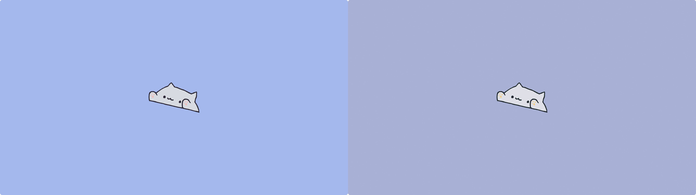

# 🗼Decay Factory 🏭

A simple cli to convert any image to a Decay themed wallpaper



decay on the right.

## Installation
1. Clone the repo.
2. Install the required packages using pip as shown below:
```
pip3 install rich image-go-nord argparse
```
3. Edit the file ```conv.py``` line 14 with your user name, DO NOT CHANGE THE DIR, IT WILL NOT WORK AS EXPECTED, IF YOU WANT TO EDIT IT THEN DO IT IN BOTH ```conv.py``` and ```decay.sh```.
4. Install it with:
```
sudo make install
```

## Usage
from your terminal run:
```
decayFactory
```
or
```
decayFactory /path/to/image/
```

 All the outputs will be in ~/Pictures/decay

 ## UNINSTALL
 1. ```cd``` into the repo folder.
 2. Uninstall it with:
 ```
 sudo make uninstall
 ```


 ## Credits
- **Made** with [Schrodinger-Hat's ImageGoNord](https://github.com/Schrodinger-Hat), but with the Decay palette
- **Text User Interface (TUI)** made with [rich](https://github.com/willmcgugan/rich)
